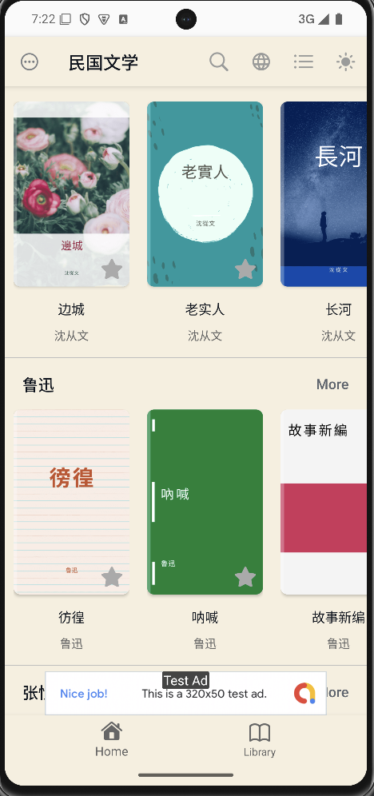
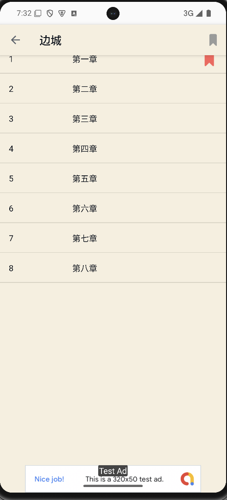
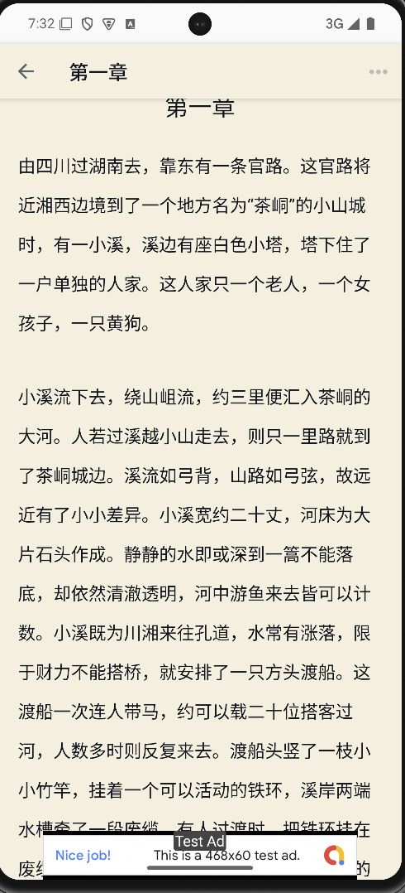

# 民国文学 Android

The 民国文学 Android app is an eBook reader that features a rich collection of classic literary works from China. With this app, users can explore famous writings by authors whose works have been featured in Chinese language textbooks for schools. The app also supports a night mode, making it convenient for reading in the dark or before bed, enhancing the overall reading experience.

## Download

Get the app on Google Play:

- [民国文学 (com.appsbay.minguoliteratural)](https://play.google.com/store/apps/details?id=com.appsbay.minguoliteratural)

## Features

1. **Offline catalog**: Read all 64 works in simplified or traditional Chinese without a download.
2. **Search and author shelves**: Find books by title or author, then browse an author's works.
3. **Favorites and progress**: Reorder saved books, resume a chapter, and keep existing bookmarks.
4. **Reader controls**: Adjust font size, choose a background, and use chapter navigation and text to speech.
5. **App language**: Choose a display language separately from the book script.
6. **Ads and optional ad removal**: Supports AdMob, rewarded ad free time, and Play Billing when configured.

## Screenshots

| Home | Chapter List | Content |
|------|-----------|-------------|
|  |  |  |

## Installation

### Step 1: Clone the Repository

```bash
git clone https://github.com/banghuazhao/Minguo-Literature-Android.git
```

### Step 2: Open the Project in Android Studio
Use Android Studio with JDK 21 and Android SDK 37. The Gradle wrapper uses Gradle 9.7 and Android Gradle Plugin 9.3.1.

### Step 3: Configure Google AdMob
1. Go to the Google Firebase Console.
2. Create a new project or select an existing one.
3. Add an Android app to your project.
4. Download the google-services.json file.
5. Place the file in the following directory:

```
app/google-services.json
```

### Step 4: Build and Run the App
Build the project and run it on an Android emulator or physical device. Debug builds use Google test ad units. Release builds require a production `AdMobAppId`, `adBannerID`, `adInterstitialID`, `adAppOpenID`, and `adRewardedID` in the untracked `local.properties` file. They also require an ignored `keystore.properties` file pointing to the upload keystore. The build fails if these values are missing or invalid. The optional `remove_ads` product must be created for this app in Play Console before its purchase option appears.

Advertising starts only after the local birth-date screen establishes eligibility and the regional privacy choice allows ads. An omitted birth date or an age below 21 leaves reading available without ad SDK initialization. The `privacyUsQa`, `privacyEeaQa`, and `privacyOtherQa` build types use release settings with forced UMP test geography for emulator checks; never upload these QA APKs to Play.

## Repository

Find the source code and contribute on GitHub: [https://github.com/banghuazhao/Minguo-Literature-Android](https://github.com/banghuazhao/Minguo-Literature-Android)

## Featured Authors
The app includes works from many renowned authors, such as:

* Lu Xun
* Ba Jin
* Shen Congwen
* Lao She
* Qian Zhongshu
* Zhang Ailing
* Zhang Henshui
* Cao Yu
* Lin Yutang
* Mao Dun
* Lin Huiyin
* Ding Ling
* Bing Xin
* Xu Zhimo
* Xiao Hong
* Yu Dafu
* Zhu Ziqing

### Some of the works included in the app are:

* Gaoshan Yinyun (The Mountain Mist)
* Fengyu Guren (Storm and Old Friends)
* Spring Bright Outside History
* My Whole Life
* Poems of Xu Zhimo Vol. 1
* March in a Small Town
* Reflections on Life
* Wandering Mind
* The Hidden Meaning of The Story of the Stone
* Ding Ling's Short and Medium-length Works
* On Women
* You Are the April of This World
* Essays by Lin Yutang
* Moment in Peking
* Written on the Edge of Life
* Collection of Essays by Zhang Ailing
* Enemies in Love
* Dream of Red Mansions
* Camel Xiangzi
* The Golden Powder Family
* *The Family Trilogy: Home, Spring, Autumn
* Wild Grass
* Night Rain in the Bashan
* Midnight
* Teahouse
* Mikan (Tangerine)
* Border Town
* The Honest Man
* The Long River
* Duck
* Mountain Spirit
* The Trilogy of Love: Mist, Rain, Electricity, Thunder
* Dawn Blossoms Plucked at Dusk
* Wandering
* Call to Arms
* New Compilation of Stories
* Thunderstorm
* Fortress Besieged
* The Wilderness
* Zhang Henshui's Essays
* Beauty's Grace
* Sobbing Marriage
* Sequel to Sobbing Marriage
* Love in a Fallen City
* The Field of Life and Death (生死场)
* Sinking (沉沦)
* Intoxicating Spring Nights (春风沉醉的晚上)

Text provenance for these three additions is recorded in [BOOK_CONTENT_SOURCES.md](BOOK_CONTENT_SOURCES.md).


## Contributions
We welcome contributions! Feel free to submit issues or pull requests to improve features or fix bugs.
